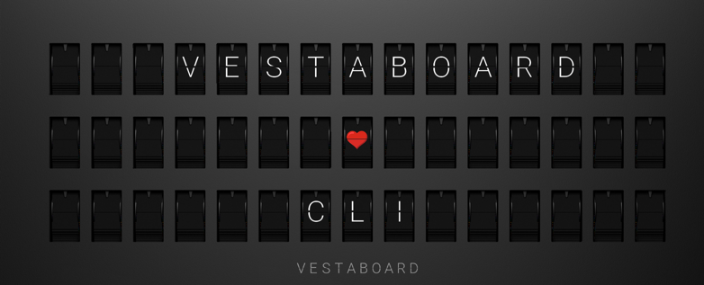

# vbcli

`vbcli` is a CLI that allows you to interact with a Vestaboard display through the Vestaboard Cloud API.

## Features

- Send raw character payloads (`send-raw`)
- Render VBML templates and send the result (`send`)
- Render VBML templates only (`format`)
- Clear the display (`clear`)
- Fetch current display state (`get`)
- Set transition options (`set-transition`)
- Fetch transition settings (`get-transition`)
- Read message input from stdin (`-`)
- Verbose HTTP debugging (`--verbose`)

## Requirements

- Go 1.24+
- A Vestaboard API key

## Installation

Build from source:

```bash
go build -o vbcli .
```

Run directly without building:

```bash
go run . --help
```

## Configuration

Set your API key in the environment:

```bash
export VESTABOARD_TOKEN="your_api_key"
```

`vbcli` sends this value in the `X-vestaboard-token` header.

Optional model default for `send`:

```bash
export VESTABOARD_MODEL="note"     # or "flagship"
```

If `VESTABOARD_MODEL` is set, it behaves like passing `--model <value>`.  
If both are provided, `--model` takes precedence.

## Usage

```bash
vbcli [global flags] <command> <arg>
```

### Global flags

- `-v, --verbose`: print request/response URL, status code, and JSON payloads
- `-h, --help`: help

### Commands

#### `send-raw`

Send a raw `characters` matrix (JSON array of arrays).  
Request payload:

```json
{
  "characters": [[72, 69, 76, 76, 79]]
}
```

Examples:

```bash
vbcli send-raw '[[72,69,76,76,79],[0,0,0,0,0]]'
cat chars.json | vbcli send-raw -
```

If no positional argument is provided, `send-raw` reads from stdin automatically.

#### `send`

Render template text through VBML, then send resulting `characters` to the Cloud API.

Template flags:

- `-m, --model`: `flagship` (default) or `note`
- `-a, --align`: `top`, `center` (default), `bottom`
- `-j, --justify`: `left`, `center` (default), `right`, `justified`
- `--format`: print VBML compose output JSON and skip sending to Cloud API

When `--model note` is used, VBML style dimensions are set to `height: 3`, `width: 15`.

Examples:

```bash
vbcli send "Hello {{now}}"
vbcli send -m note -a top -j left "Hello\nworld"
vbcli send "hello {green}"
echo "From stdin" | vbcli send -
```

If no positional argument is provided, `send` reads from stdin automatically.

#### `format`

Format template text through VBML and print the resulting `characters` JSON to stdout.  
Equivalent to `send --format`.

Flags are the same as `send` (`-m`, `-a`, `-j`).

Examples:

```bash
vbcli format "Hello {{now}}"
vbcli format -m note -a top -j left "hello {green}"
echo "From stdin" | vbcli format -
```

#### `clear`

Clear the display. Equivalent to:

```bash
vbcli send ''
```

Examples:

```bash
vbcli clear
vbcli clear -m note
```

#### `get`

Fetch current display state and print JSON to stdout.

Use `--layout` to print only `currentMessage.layout`.

Example:

```bash
vbcli get
vbcli get --layout
```

#### `set-transition`

Set transition type and speed via the transition API.

Required flags:

- `--type`: `classic`, `wave`, `drift`, `curtain`
- `--speed`: `fast` or `gentle`

Examples:

```bash
vbcli set-transition --type wave --speed fast
vbcli set-transition --type curtain --speed gentle
```

#### `get-transition`

Fetch transition settings and pretty-print JSON to stdout.

Example:

```bash
vbcli get-transition
```

## Template special aliases

For `send`, named codes in `{...}` are converted before VBML (for example `{green}` -> `{66}`).

Supported aliases include:

- Colors: `{red}`, `{orange}`, `{yellow}`, `{green}`, `{blue}`, `{violet}`/`{purple}`, `{white}`, `{black}`
- Symbols: `{heart}`, `{degree}`, `{filled}`, `{question}`, `{slash}`, `{comma}`, `{period}`
- Punctuation aliases: `{hash}`/`{pound}`, `{dash}`/`{hyphen}`, `{equals}`/`{equal}`, etc.

Numeric codes are also supported directly (for example `{66}`).

## Behavior notes

- HTTP `409 Conflict` from the Cloud API is treated as success (display already matches requested state).
- For `send`, escaped sequences like `\n` are decoded before sending.
- `send` accepts VBML expressions like `{{...}}`; these are preserved.
- For `send`, if input looks like a raw characters matrix (`[...]`), it is routed through the `send-raw` behavior.

## Help

```bash
vbcli --help
vbcli help
vbcli send-raw --help
vbcli send --help
vbcli format --help
vbcli clear --help
vbcli get --help
vbcli set-transition --help
vbcli get-transition --help
```

## Development

Run tests:

```bash
go test ./...
```

## References

- Vestaboard Read/Write API: https://docs.vestaboard.com/docs/read-write-api/endpoints
- Vestaboard VBML: https://docs.vestaboard.com/docs/vbml/
